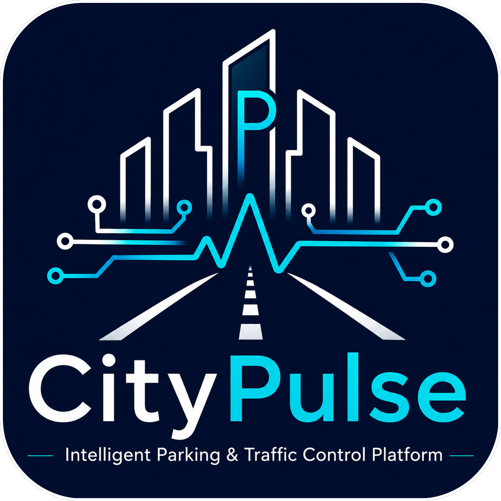
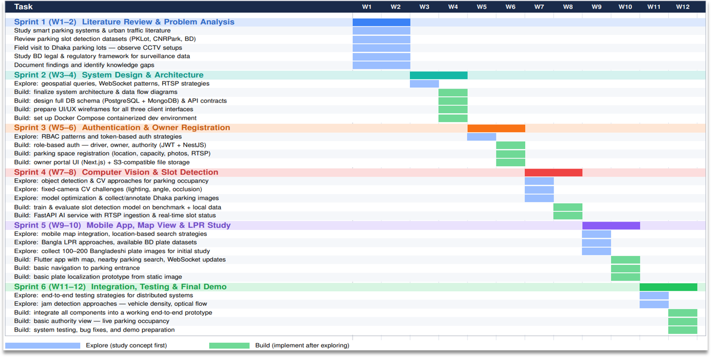

<div align="center">



# CityPulse: Intelligent Parking & Traffic Control Platform

> Connecting Drivers, Parking Owners & Authorities for Smarter Cities

**CSE499A — Section 15 — Project Group 03**

</div>

---

## Overview

Traffic congestion is a daily crisis in urban Bangladesh, and one of its leading causes is illegal roadside parking. When drivers cannot find organized parking, they stop wherever they can — blocking lanes and triggering chain jams that can last for hours. The current response of deploying traffic police at every busy intersection is unsustainable in extreme heat and heavy rain.

CityPulse is an intelligent parking and traffic management platform designed to address this problem. It connects three groups of people in one place: drivers who need parking, space owners who have parking, and city or traffic authorities who need better control over the roads.

Parking owners register their spaces and connect existing CCTV cameras. The system uses computer vision and machine learning to monitor slot availability in real time. Drivers use a mobile app to find nearby available parking on a map and navigate there directly. On the surveillance side, AI-powered cameras at busy intersections detect jam-causing vehicles, read license plates in Bangla and English, track suspicious movement, and share data with law enforcement when needed.

### Quick Links

- [Overview](#overview)
- [Project Structure](#project-structure)
- [Work Plan](#work-plan)
- [Team Structure](#team-structure)

---

## Project Structure

```
project-499/
├── applications/
│   ├── web/              # Web services
│   │   ├── backend/      # Backend service
│   │   └── frontend/     # Frontend service
│   ├── mobile/           # Mobile service
│   ├── ai/               # AI/ML service
│   │   └── data/         # Datasets
│   └── support/          # Shared utilities & helpers
├── others/               # Deliverables & documentation
└── README.md             # Project overview
```

**Structure Updated:** 2026-06-18

---

## Work Plan



### Sprint 1 (W1–2) — Literature Review & Problem Analysis
| Status | Task |
|:---:|---|
| ✅ | Study smart parking systems & urban traffic literature |
| ✅ | Review parking slot detection datasets (PKLot, CNRPark, BD) |
| ✅ | Field visit to Dhaka parking lots — observe CCTV setups |
| ✅ | Study BD legal & regulatory framework for surveillance data |
| ✅ | Document findings and identify knowledge gaps |

### Sprint 2 (W3–4) — System Design & Architecture
| Status | Task |
|:---:|---|
| ⬜ | Explore: geospatial queries, WebSocket patterns, RTSP strategies |
| ⬜ | Build: finalize system architecture & data flow diagrams |
| ⬜ | Build: design full DB schema (PostgreSQL + MongoDB) & API contracts |
| ⬜ | Build: prepare UI/UX wireframes for all three client interfaces |
| ⬜ | Build: set up Docker Compose containerized dev environment |

### Sprint 3 (W5–6) — Authentication & Owner Registration
| Status | Task |
|:---:|---|
| ⬜ | Explore: RBAC patterns and token-based auth strategies |
| ⬜ | Build: role-based auth — driver, owner, authority (JWT + NestJS) |
| ⬜ | Build: parking space registration (location, capacity, photos, RTSP) |
| ⬜ | Build: owner portal UI (Next.js) + S3-compatible file storage |

### Sprint 4 (W7–8) — Computer Vision & Slot Detection
| Status | Task |
|:---:|---|
| ⬜ | Explore: object detection & CV approaches for parking occupancy |
| ⬜ | Explore: fixed-camera CV challenges (lighting, angle, occlusion) |
| ⬜ | Explore: model optimization & collect/annotate Dhaka parking images |
| ⬜ | Build: train & evaluate slot detection model on benchmark + local data |
| ⬜ | Build: FastAPI AI service with RTSP ingestion & real-time slot status |

### Sprint 5 (W9–10) — Mobile App, Map View & LPR Study
| Status | Task |
|:---:|---|
| ⬜ | Explore: mobile map integration, location-based search strategies |
| ⬜ | Explore: Bangla LPR approaches, available BD plate datasets |
| ⬜ | Explore: collect 100–200 Bangladeshi plate images for initial study |
| ⬜ | Build: Flutter app with map, nearby parking search, WebSocket updates |
| ⬜ | Build: basic navigation to parking entrance |
| ⬜ | Build: basic plate localization prototype from static image |

### Sprint 6 (W11–12) — Integration, Testing & Final Demo
| Status | Task |
|:---:|---|
| ⬜ | Explore: end-to-end testing strategies for distributed systems |
| ⬜ | Explore: jam detection approaches — vehicle density, optical flow |
| ⬜ | Build: integrate all components into a working end-to-end prototype |
| ⬜ | Build: basic authority view — live parking occupancy |
| ⬜ | Build: system testing, bug fixes, and demo preparation |

---

## Team Structure

<table>
<tr>
<th align="left">Name</th>
<th align="left">Role</th>
<th align="left">Department</th>
<th align="left">Email</th>
<th align="left">GitHub</th>
</tr>
<tr>
<td>Md. Rahad Hossain</td>
<td>AI/ML, Backend</td>
<td>ECE</td>
<td>sys.rahad[at]gmail[dot]com</td>
<td><a href="https://github.com/rahad-dll">rahad-dll</a></td>
</tr>
<tr>
<td>Md. Yousuf</td>
<td>AI/ML, Mobile</td>
<td>ECE</td>
<td></></td>
<td></></td>
</tr>
<tr>
<td>MD. Rokib Hasan Oli</td>
<td>AI/ML, Frontend</td>
<td>ECE</td>
<td>rokib.oli@northsouth.edu</td>
<td><a href="https://github.com/Rokib-Hasan-Oli">Rokib</a></td>
</tr>
</table>

---

**README Updated:** 2026-06-27


