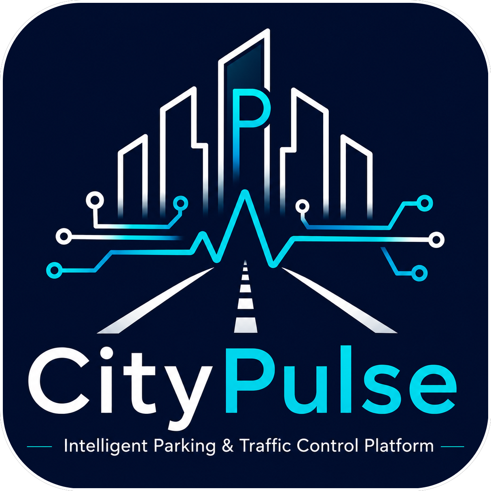
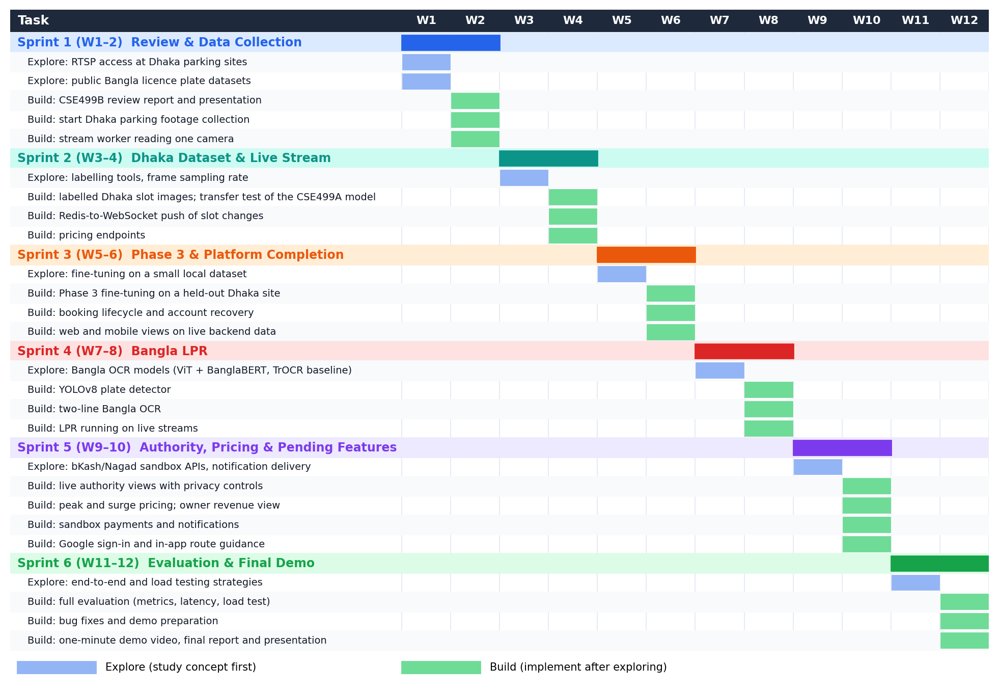

<div align="center">



# CityPulse: Intelligent Parking & Traffic Control Platform

> Connecting Drivers, Parking Owners & Authorities for Smarter Cities

**CSE499A / CSE499B — Section 15 — Project Group 03**

</div>

---

## Overview

Traffic congestion is a daily crisis in urban Bangladesh, and one of its leading causes is illegal roadside parking. When drivers cannot find organized parking, they stop wherever they can — blocking lanes and triggering chain jams that can last for hours. The current response of deploying traffic police at every busy intersection is unsustainable in extreme heat and heavy rain.

CityPulse is an intelligent parking and traffic management platform designed to address this problem. It connects three groups of people in one place: drivers who need parking, space owners who have parking, and city or traffic authorities who need better control over the roads.

Parking owners register their spaces and connect existing CCTV cameras. The system uses computer vision and machine learning to monitor slot availability in real time. Drivers use a mobile app to find nearby available parking on a map and navigate there directly. On the surveillance side, AI-powered cameras at busy intersections detect jam-causing vehicles, read license plates in Bangla and English, track suspicious movement, and share data with law enforcement when needed.

### Quick Links

- [Overview](#overview)
- [Project Structure](#project-structure)
- [CSE499A Summary](#cse499a-summary)
- [CSE499B Work Plan](#cse499b-work-plan)
- [Deliverables](#deliverables)
- [Team Structure](#team-structure)

---

## Project Structure

```
project-499/
├── applications/
│   ├── web/              # Web services
│   │   ├── backend/      # Backend service (see full at. applications/web/backend/README.md)
│   │   └── frontend/     # Frontend service (see full at. applications/web/frontend/README.md)
│   ├── mobile/           # Mobile service
│   ├── ai/               # AI/ML service
│   │   └── data/         # Datasets
│   └── support/          # Shared utilities & helpers
├── others/               # Deliverables & documentation
│   └── 499A/             # CSE499A reports, presentations, demo video, paper reviews
└── README.md             # Project overview
```

**Structure Updated:** 2026-10-07

---

## CSE499A Summary

**Completed**

- Literature review, Dhaka field visit, legal review, system architecture, and database schema.
- MobileNetV2 occupancy model: **99.18%** validation accuracy on an unseen parking lot (808,991 training images from PKLot and CNRPark+EXT); VPS-Net occupancy stage reproduced at **98.53%**.
- NestJS backend with role-based access, parking spaces, and bookings; FastAPI inference service.
- Flutter driver app: map search, booking, booking history, and profile on the live backend.
- Next.js owner and authority portals with role-based routing.

**Carried into CSE499B:** live camera streams, Dhaka data, Bangla LPR, live authority and owner data, notifications, navigation to the parking entrance, and end-to-end testing.

---

## CSE499B Work Plan



### Sprint 1 (W1–2) — Review & Data Collection

- [ ] Explore: RTSP access at Dhaka parking sites
- [ ] Explore: public Bangla licence plate datasets
- [ ] Build: CSE499B review report and presentation
- [ ] Build: start Dhaka parking footage collection
- [ ] Build: stream worker reading one camera

### Sprint 2 (W3–4) — Dhaka Dataset & Live Stream

- [ ] Explore: labelling tools, frame sampling rate
- [ ] Build: labelled Dhaka slot images; transfer test of the CSE499A model
- [ ] Build: Redis-to-WebSocket push of slot changes
- [ ] Build: pricing endpoints

### Sprint 3 (W5–6) — Phase 3 & Platform Completion

- [ ] Explore: fine-tuning on a small local dataset
- [ ] Build: Phase 3 fine-tuning on a held-out Dhaka site
- [ ] Build: booking lifecycle and account recovery
- [ ] Build: web and mobile views on live backend data

### Sprint 4 (W7–8) — Bangla LPR

- [ ] Explore: Bangla OCR models (ViT + BanglaBERT, TrOCR baseline)
- [ ] Build: YOLOv8 plate detector
- [ ] Build: two-line Bangla OCR
- [ ] Build: LPR running on live streams

### Sprint 5 (W9–10) — Authority, Pricing & Pending Features

- [ ] Explore: bKash/Nagad sandbox APIs, notification delivery
- [ ] Build: live authority views with privacy controls
- [ ] Build: peak and surge pricing; owner revenue view
- [ ] Build: sandbox payments and notifications
- [ ] Build: Google sign-in and in-app route guidance

### Sprint 6 (W11–12) — Evaluation & Final Demo

- [ ] Explore: end-to-end and load testing strategies
- [ ] Build: full evaluation (metrics, latency, load test)
- [ ] Build: bug fixes and demo preparation
- [ ] Build: one-minute demo video, final report and presentation

---

## Deliverables

**CSE499B** — [Review report](others/CSE499B-review-report.pdf) · [Review presentation](others/CSE499B-project-review-presentation.pptx)

**CSE499A** — [Proposal report](others/499A/CSE499A-project-proposal-report.pdf) · [Final report](others/499A/CSE499A-project-final-report.pdf) · [Final presentation](others/499A/CSE499A-project-final-presentation.pptx) · [Demo video](others/499A/demo-1min.mp4) · [All CSE499A files](others/499A)

---

## Team Structure

<table>
<tr>
<th align="left">Name</th>
<th align="left">Role</th>
<th align="left">Department</th>
<th align="left">Email</th>
<th align="left">GitHub</th>
</tr>
<tr>
<td>Md. Rahad Hossain</td>
<td>AI/ML, Backend</td>
<td>ECE</td>
<td>sys.rahad[at]gmail[dot]com</td>
<td><a href="https://github.com/rahad-dll">rahad-dll</a></td>
</tr>
<tr>
<td>Md. Yousuf</td>
<td>AI/ML, Mobile</td>
<td>ECE</td>
<td></></td>
<td></></td>
</tr>
<tr>
<td>MD. Rokib Hasan Oli</td>
<td>AI/ML, Frontend</td>
<td>ECE</td>
<td>rokib.oli@northsouth.edu</td>
<td><a href="https://github.com/Rokib-Hasan-Oli">Rokib</a></td>
</tr>
<tr>
<td>Safayat Ibrahim</td>
<td>Joined in CSE499B</td>
<td>ECE</td>
<td></></td>
<td></></td>
</tr>
</table>

---

**README Updated:** 2026-10-07
