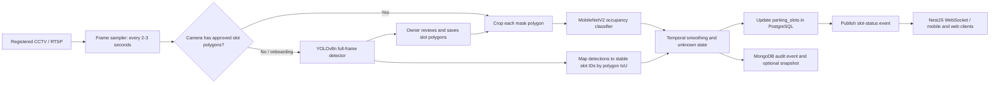

# YOLOv8 Parking Detection Review, Training Audit, and CityPulse Adoption Plan

**Project:** CityPulse: Intelligent Parking & Traffic Control Platform  
**Review date:** 2026-08-09  
**Artifacts reviewed:**

- `applications/web/frontend/ml/Optimizing YOLOv8 for Parking Space Detection.pdf`
- `others/CSE499A-project-proposal-report.pdf`
- `optimizing-yolov8-for-parking-space-detection.ipynb` (completed Kaggle run)
- Current CityPulse AI service, backend schema, and occupancy-model documentation

## 1. Executive conclusion

The notebook did **not fail during training**. All five YOLO variants completed 20 epochs on two Tesla T4 GPUs in 6.04 hours and were evaluated on the 1,242-image PKLot test split. The reproduced metrics are close to the paper, which confirms that the corrected notebook is technically usable.

The larger problem is **experimental validity and project fit**, not a broken training loop:

1. The paper's committed custom YAML files do not reproduce its reported architectures unless the missing `scales: n: [0.33, 0.25, 1024]` block is restored. The notebook correctly restores it.
2. The paper and its own logs disagree about whether EfficientNetV2 or VGG16 is best. The new run ranks VGG16 first on test mAP50:95.
3. The paper's latency table is not a fair model comparison because models were timed on different hardware. Same-GPU measurements in the notebook show VGG16 and EfficientNetV2 are far slower than the paper suggests.
4. PKLot-only accuracy does not prove that a model will work on Dhaka CCTV. Neither the supplied YOLO run nor the active MobileNetV2 documentation demonstrates completed fine-tuning and testing on local Bangladeshi footage.
5. CityPulse's current architecture is better suited to a **hybrid approach** than a direct replacement with the paper's largest model.

### Recommended decision

- Keep the current **MobileNetV2 per-slot classifier** as the production MVP for fixed cameras with registered slot polygons.
- Add **YOLOv8n** as the first full-frame detection challenger and as an onboarding/auto-calibration aid.
- Test **YOLO-ResNet-18** only if local-Dhaka evaluation shows that its stricter localization improvement justifies its higher latency.
- Do not deploy VGG16, EfficientNetV2, or Ghost-P2 based only on the paper's PKLot numbers.
- Make local-data validation, RTSP ingestion, persistent slot updates, and temporal smoothing the immediate priorities.

## 2. What the paper, notebook, and CityPulse each solve

| Artifact | Input | Output | Main purpose | Important limitation |
|---|---|---|---|---|
| Research paper | Full 640 x 640 parking-lot frame | Bounding boxes labeled empty/occupied | Compare YOLOv8 backbones on PKLot | Fixed Brazilian cameras; no Dhaka test; paper/repository inconsistencies |
| Reproduction notebook | PKLot v2 full frames | Five trained YOLO models and test metrics | Reproduce and audit Tables 3-4 | Still PKLot-only; 20 epochs and one seed |
| CityPulse MobileNetV2 | Pre-cropped 224 x 224 slot image | Empty/occupied class and confidence | Fast occupancy classification for known slots | Requires upstream cropping from stored polygons |
| CityPulse database | Registered camera and slot metadata | Stable `camera_id`, `slot_id`, polygon, occupancy state | Connect predictions to product data | Current inference path does not yet update these fields continuously |
| CityPulse proposal | Continuous CCTV/RTSP feed | Real-time availability in web/mobile apps | End-to-end smart-parking product | RTSP processing, real-time persistence, and WebSocket delivery are not complete |

The paper's YOLO models and CityPulse's current MobileNetV2 model are therefore **complementary**. YOLO can locate/classify slots in a full frame. MobileNetV2 can classify a known slot crop cheaply and consistently after a camera has been configured.

## 3. Paper method and reported result

The paper replaces the YOLOv8n backbone with ResNet-18, VGG16, or EfficientNetV2-S, and also tests a Ghost-P2 model with an extra high-resolution P2 detection head. All variants use PKLot v2, a 70/20/10 image split, 640 x 640 input, batch 16, 20 epochs, and an auto-selected AdamW optimizer.

### Paper Table 3 versus the completed notebook

All notebook values below are from a separate `val(split="test")` pass on the same 1,242-image test split and the same Tesla T4.

| Model | Paper mAP50:95 | Notebook test mAP50:95 | Delta | Notebook precision | Notebook recall | Same-T4 inference |
|---|---:|---:|---:|---:|---:|---:|
| YOLOv8n | 0.970 | 0.9658 | -0.0042 | 0.9969 | 0.9971 | **3.84 ms** |
| YOLO-ResNet-18 | 0.976 | 0.9749 | -0.0011 | 0.9974 | 0.9973 | 10.17 ms |
| YOLO-VGG16 | 0.985 | **0.9863** | +0.0013 | 0.9975 | 0.9974 | 46.60 ms |
| YOLO-EfficientNetV2 | **0.986** | 0.9844 | -0.0016 | 0.9977 | 0.9976 | 31.00 ms |
| YOLO-Ghost-P2 | 0.896 | 0.8913 | -0.0047 | 0.9617 | 0.9727 | 5.73 ms |

### Interpretation

- The reproduction is close enough to validate the corrected training pipeline.
- VGG16 is best on strict test localization in this run, but it is about **12 times slower than YOLOv8n** on the same T4 and uses much more compute.
- EfficientNetV2 is nearly as accurate as VGG16 but is about **8 times slower than YOLOv8n**.
- ResNet-18 provides a modest mAP50:95 gain of 0.0091 over YOLOv8n at about 2.7 times the latency.
- Ghost-P2 is not an attractive deployment choice: its small-model advantage does not beat YOLOv8n in measured latency, and its mAP50:95 is substantially worse.
- At the product level, YOLOv8n is the best initial full-frame **accuracy/speed Pareto choice**. GPU timing must not be presented as Raspberry Pi or CPU timing.

## 4. Training and reproducibility problems

### 4.1 Problems in the paper/repository

| Priority | Problem | Evidence | Impact | Required action |
|---|---|---|---|---|
| High | Missing model scaling in committed YAMLs | Without the nano `scales` block, ResNet-18 and EfficientNetV2 build much larger necks than Table 4 | Training the repository as committed does not reproduce the paper | Use the corrected notebook YAMLs and archive them with the experiment |
| High | VGG16 configuration is not available exactly | The notebook's reconstruction has 16.93 M parameters and 256.4 GFLOPs versus 17.78 M and 262.1 GFLOPs in the paper | The VGG16 result is structurally close but not an exact architecture reproduction | Label it as a reconstruction; do not claim bit-exact reproduction |
| High | Paper and raw logs disagree on the top model | Paper: EfficientNetV2 0.986; repository validation logs: VGG16 0.9861, EfficientNetV2 0.9827; notebook test: VGG16 0.9863 | The paper's conclusion that EfficientNetV2 is best is not stable | Report both sources and use the new same-pipeline test ranking |
| High | Inference latency uses mixed hardware | The paper lists VGG16 at 3.3 ms despite 262.1 GFLOPs, while ResNet-18 is 9 ms at 35.2 GFLOPs | Speed ranking is misleading | Benchmark every candidate on the same CityPulse deployment device |
| Medium | Only one run/seed and 20 epochs | No repeated trials or confidence intervals; deeper-model curves are still stabilizing | Tiny 0.001-0.002 differences may be random variation | Run at least three local-data seeds for shortlisted models and report mean plus standard deviation |
| Medium | Dataset grouping is not demonstrated | Paper states a 70/20/10 image split but does not show separation by camera, parking lot, or day | Adjacent time-lapse frames and the same fixed views may leak scene information across splits | Split local data by camera/site/day, not random frames |
| Medium | Claimed hard cases are not separately evaluated | Paper motivates darkness, partial vehicles, motorcycles, and occlusion but gives only aggregate PKLot metrics | High aggregate mAP may hide the exact CityPulse failure cases | Create condition-specific Dhaka test sets |
| Low | Technical/reporting errors | Recall equation is labeled Precision; third detection head is described as small rather than large; YOLOv8 descriptions mix anchor-free and anchor terminology | Reduces confidence in the written methodology | Correct these points in the CityPulse literature review |

### 4.2 Findings from the supplied notebook

The notebook execution itself is healthy:

- GPU and CUDA checks passed on two Tesla T4 cards.
- Dataset counts match the paper: 8,691 train, 2,483 validation, and 1,242 test images.
- All corrected model shapes and layer counts passed a forward test.
- All five variants completed 20 epochs; there are no recorded OOM, DDP, CUDA, or training failures.
- Test evaluation contains 70,684 annotated parking-space instances.

However, these points must be fixed before the notebook is shared or treated as a formal experiment:

1. **Rotate the Roboflow API key.** A live key is embedded directly in the configuration cell. Remove it from the notebook and read it from a Kaggle Secret or environment variable.
2. **Record the real environment as a deviation.** The notebook used PyTorch 2.10/CUDA 12.8/Ultralytics 8.3.100 and dual-T4 DDP. The paper reports PyTorch 2.6/CUDA 12.4 and A100/T4 hardware. This is a valid reproduction, but not a bit-identical environment.
3. **Do not claim exact training parity from `workers=2`.** It matches paper Table 2, but the authors' saved run arguments reportedly used 8 workers. Worker count mainly affects throughput, yet it is still a reproducibility difference.
4. **Preserve best and final-epoch semantics.** Test evaluation uses `best.pt`, while repository comparisons may use final rows from `results.csv`. State which checkpoint and split produced every table.
5. **Keep augmentation provenance.** Notebook logs show Ultralytics HSV/translation/scaling/flipping/mosaic plus Albumentations blur/median-blur at low probability. Save the complete training arguments and library versions because not every effective transform appears in `args.yaml`.
6. **Avoid treating saturated PKLot metrics as deployment evidence.** Four models have precision/recall near 0.997. The important experiment is cross-camera, cross-site performance on unseen Dhaka footage.

## 5. Comparison with CityPulse's proposal and current implementation

### 5.1 What already aligns well

- The proposal's `cameras.rtsp_url` concept exists in the PostgreSQL schema.
- `parking_slots` already has `camera_id`, `mask_polygon`, `occupied`, `confidence_score`, and `last_updated` fields.
- The FastAPI service supports single and batch crop classification.
- MobileNetV2 phase 2 is documented at 0.9918 validation accuracy on a held-out international parking lot, which is a stronger split design than a random frame split.
- The NestJS backend can call the AI service with a protected internal token.

### 5.2 Gaps between the proposal and the code

| Gap | Current evidence | Project consequence |
|---|---|---|
| No continuous RTSP worker | FastAPI accepts uploaded image files; it does not open registered RTSP streams | The proposal's automatic monitoring loop does not yet exist |
| Slot cropper is missing from the end-to-end path | API documentation says an upstream service must crop stored polygons | Registered `mask_polygon` data is not yet converted into model-ready frames automatically |
| Backend inference uses a synthetic slot ID | `spaces.service.ts` sends `${spaceId}-slot` instead of a real `parking_slots.id` | Predictions cannot reliably update individual slots |
| Predictions are not persisted to PostgreSQL slot state | The backend returns status but does not update `occupied`, `confidence_score`, or `last_updated` | Mobile/web availability can become disconnected from AI output |
| No temporal stabilization | Each crop produces an immediate independent label | Headlights, shadows, people, and compression can cause rapid status flicker |
| Alternate model selector is unsafe | `predictor.py` always constructs MobileNetV2 even when `slot-occupancy` resolves to VPS-Net weights | Selecting VPS-Net can fail checkpoint loading; model-specific loaders are required |
| No local-Dhaka test evidence | Current YOLO run uses PKLot; MobileNetV2 docs say local fine-tuning is future work | The central research claim in the proposal is not yet validated |
| Real-time delivery is incomplete | No implemented camera-to-slot event stream/WebSocket path is shown | Drivers cannot receive trustworthy live availability updates |
| Documentation is inconsistent | Top-level AI README says phase 2 is pending while the model README marks phase 2 active | Team members may deploy or report the wrong model status |

The proposal PDF itself also contains unresolved LaTeX references such as `[?]`, `Table ??`, and `Figure ??`. These should be fixed before the next academic submission.

## 6. Recommended CityPulse architecture

### Why this hybrid is preferable

- Known fixed-camera geometry makes per-slot classification efficient and gives every result a stable product ID.
- YOLO reduces manual work during camera onboarding and can recover when polygons are missing or the scene changes.
- Keeping a reviewed polygon layer prevents detections from changing slot identity frame to frame.
- A temporal state machine converts noisy frame predictions into a reliable availability signal.

### Suggested state rule

Use `available`, `occupied`, `unknown`, and `stale` internally even if the user interface only shows available/unavailable:

- Mark occupied after at least 3 occupied predictions in the latest 5 samples.
- Mark available only after at least 4 empty predictions in the latest 5 samples, because a false-free result is more harmful to drivers.
- Mark unknown when confidence is below a locally calibrated threshold or models disagree.
- Mark stale when no valid camera result has arrived within a configured time window.

These numbers are starting values and must be calibrated on local video.

## 7. Model-selection plan for CityPulse

| Candidate | Recommended role | Reason |
|---|---|---|
| MobileNetV2 phase 2 | Production MVP for known slots | Already integrated, light, strong held-out-lot validation, suitable for crop batches and edge inference |
| YOLOv8n | Full-frame production challenger and onboarding model | Best reproduced speed/accuracy trade-off; 3.01 M parameters and 3.84 ms on T4 |
| YOLO-ResNet-18 | Accuracy challenger on a central GPU | Modest strict-mAP improvement; acceptable only if local false-free errors decrease materially |
| YOLO-VGG16 | Research upper-bound only | Highest reproduced mAP50:95 but excessive compute and 46.6 ms same-T4 latency |
| YOLO-EfficientNetV2 | Research upper-bound only | Very strong accuracy but 31 ms same-T4 latency and no clear advantage over VGG16/ResNet in the new run |
| YOLO-Ghost-P2 | Do not select now | Lower accuracy and no measured speed advantage over YOLOv8n |

Do not compare the MobileNetV2 accuracy value directly with YOLO mAP. They solve different evaluation tasks. Compare them at the **slot-status product level** on the same Dhaka videos.

## 8. Local training and evaluation protocol

### 8.1 Data collection

Collect full frames and videos from at least three distinct Dhaka parking sites, with owner permission and a documented retention policy. Cover:

- different camera heights, angles, lenses, and compression levels;
- daylight, evening, night, rain, glare, and deep shadow;
- sedans, SUVs, buses, CNGs, motorcycles, and partially visible vehicles;
- people, carts, construction materials, and other non-vehicle occluders;
- empty lots, nearly full lots, and transitions into/out of slots.

### 8.2 Split design

- **Training:** selected cameras/sites/days.
- **Validation:** different days and at least one unseen camera.
- **Final test:** an untouched site or cameras not present in training.
- Do not place adjacent frames from the same time sequence into different splits.
- Keep a separately labeled night/rain/occlusion challenge set.

### 8.3 Training stages

1. Preserve the completed PKLot run as the benchmark reproduction.
2. Train/fine-tune MobileNetV2 on PKLot + CNRPark + local slot crops.
3. Fine-tune YOLOv8n on PKLot + local full-frame annotations.
4. Train YOLO-ResNet-18 only after YOLOv8n establishes a full-frame baseline.
5. Use early stopping and a longer maximum than 20 epochs for local fine-tuning; select duration from validation behavior rather than copying the paper blindly.
6. Repeat shortlisted runs with at least three seeds.
7. Export and benchmark the selected model in its deployment format (PyTorch, ONNX, or TensorRT) on the actual target hardware.

### 8.4 Required metrics

Report more than aggregate accuracy/mAP:

- occupied recall and empty recall;
- false-free rate: occupied slot reported as available;
- false-occupied rate: empty slot reported as occupied;
- per-site, per-camera, day/night, rain, occlusion, and motorcycle results;
- availability-count mean absolute error per frame;
- status-flip rate for a physically unchanged slot;
- end-to-end P50/P95 latency from frame capture to database update;
- inference throughput and memory on the real deployment device;
- camera stale/offline detection time.

Suggested provisional acceptance gates for the demo are false-free rate <= 1%, occupied recall >= 98%, availability-count MAE <= 1 slot per camera frame, and end-to-end P95 update time <= 3 seconds. Final thresholds should be agreed with the team after the first local pilot.

## 9. Implementation sequence

### Phase A - Reproducibility and security

1. Rotate the exposed Roboflow API key and replace notebook literals with Kaggle Secrets.
2. Save the corrected YAMLs, notebook, `my_results.csv`, comparison CSV, plots, and exact package versions together.
3. Clearly label test versus validation results and best versus final checkpoint.
4. Update the top-level AI README to show MobileNetV2 phase 2 as active.

### Phase B - Complete the fixed-camera MVP

1. Implement an RTSP frame sampler with reconnect, timeout, and heartbeat handling.
2. Read each slot's `mask_polygon`, crop the frame, and call batch inference.
3. Pass real `parking_slots.id` values rather than a synthetic space-level ID.
4. Add temporal smoothing and `unknown/stale` states.
5. Update `occupied`, `confidence_score`, and `last_updated` transactionally.
6. Publish changed slot states to NestJS and WebSocket clients; do not publish unchanged frames repeatedly.

### Phase C - Add YOLO as a challenger

1. Add a model-specific YOLO loader; do not route YOLO/VPS weights through the MobileNet constructor.
2. Add a full-frame endpoint or worker path that returns boxes, classes, and confidence.
3. Map detections to configured slot polygons using overlap/IoU and preserve stable IDs.
4. Run shadow-mode comparison against MobileNetV2 on local video without changing user-visible availability.
5. Promote YOLO only if it improves local product metrics at acceptable latency/cost.

### Phase D - Product hardening

1. Add per-camera thresholds, model version, and configuration version to every inference event.
2. Store low-confidence/disagreement snapshots for active learning.
3. Add camera-health alerts and stale-state handling.
4. Build monitoring for false status flips, inference latency, queue depth, and model drift.

## 10. How to use the paper in the CSE499 project

The paper is useful as:

- a reproducible benchmark for backbone trade-offs;
- evidence that full-frame empty/occupied slot detection can reach high PKLot accuracy;
- a starting point for a CityPulse-specific speed/accuracy experiment;
- motivation for testing edge-friendly versus server-side models.

It should **not** be used to claim that CityPulse already achieves 98-99% accuracy in Dhaka. A defensible project contribution would be:

> Reproduce the published PKLot benchmark, identify its reproducibility limitations, build a hybrid fixed-camera pipeline, and measure cross-camera generalization on a locally collected Dhaka test set.

That is stronger academically and more useful as a product than simply selecting the largest backbone from Table 3.

## 11. Final answer

The corrected notebook successfully reproduces the paper within small metric differences, but the paper's architecture files, top-model conclusion, and latency comparison contain material inconsistencies. For CityPulse, the right next step is not to replace the existing classifier with EfficientNetV2 or VGG16. Complete the current polygon-based MobileNetV2 RTSP pipeline, validate it on local Dhaka footage, and run YOLOv8n in parallel as a full-frame challenger. Promote a different backbone only when it improves local false-free and reliability metrics on the same deployment hardware.

